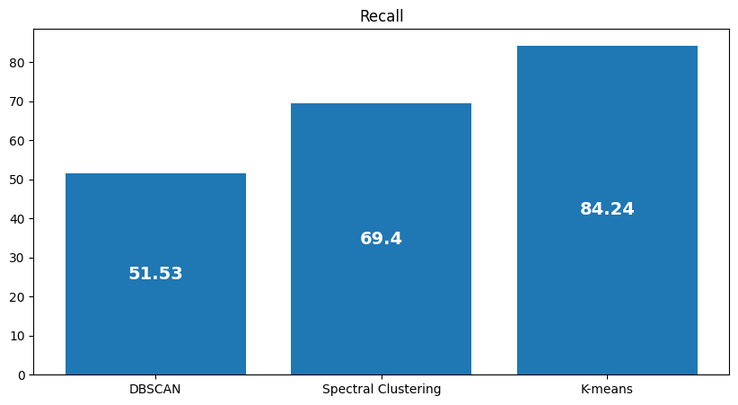
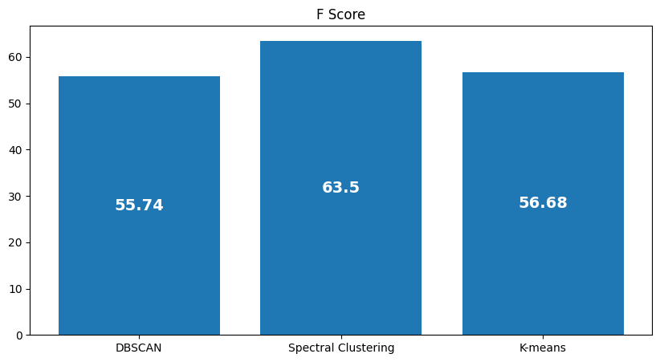

# Activity Detection
Activity Detection using Unsupervised Learning Algorithms: **DBSCAN**, **K-Means** & **Spectral Clustering**

## Dataset
Daily & Sports Activity [Dataset](https://www.kaggle.com/datasets/obirgul/daily-and-sports-activities/data)

#### Brief Description of the Dataset:

Each of the 19 activities is performed by eight subjects (4 female, 4 male, between the ages 20 and 30) for 5 minutes. <br>
Total signal duration is 5 minutes for each activity of each subject.<br>
The 5-min signals are divided into 5-sec segments so that 480(=60x8) signal segments are obtained for each activity. <br>

#### The 19 activities are:
- sitting (A1)
- standing (A2)
- lying on back and on right side (A3 and A4)
- ascending and descending stairs (A5 and A6)
- standing in an elevator still (A7)
- and moving around in an elevator (A8)
- walking in a parking lot (A9)
- walking on a treadmill with a speed of 4 km/h (in flat and 15 deg inclined positions) (A10 and A11)
- running on a treadmill with a speed of 8 km/h (A12)
- exercising on a stepper (A13)
- exercising on a cross trainer (A14)
- cycling on an exercise bike in horizontal and vertical positions (A15 and A16)
- rowing (A17)
- jumping (A18)
- and playing basketball (A19)

#### File structure:

- 19 activities (a) (in the order given above)
- 8 subjects (p)
- 60 segments (s)
- 5 units on torso (T), right arm (RA), left arm (LA), right leg (RL), left leg (LL)
- 9 sensors on each unit (x,y,z accelerometers, x,y,z gyroscopes, x,y,z magnetometers)

Folders a01, a02, …, a19 contain data recorded from the 19 activities. <br>

For each activity, the subfolders p1, p2, …, p8 contain data from each of the 8 subjects. <br>

In each subfolder, there are 60 text files s01, s02, …, s60, one for each segment.

## DBSCAN

- DBSCAN (Density-Based Spatial Clustering of Applications with Noise) is an unsupervised machine learning algorithm that is used for clustering tasks. Unlike other clustering algorithms such as K-Means, DBSCAN does not require the user to specify the number of clusters in advance.

- DBSCAN works by defining a neighborhood around each data point. If there are at least a minimum number of points (`min_samples`) within a certain distance (`eps`) of a data point, that data point is considered a core point. Points that are within the `eps` distance of a core point, but do not have `min_samples` within their own `eps` distance, are considered to be border points. All other points are considered noise points.

- DBSCAN has several advantages over other clustering algorithms. It can find arbitrarily shaped clusters, it has a notion of noise, and it does not require the user to specify the number of clusters. However, it can be sensitive to the settings of `eps` and `min_samples`, and it does not perform well when the clusters have different densities.

<hr>

**Pros:**
- DBSCAN can find arbitrarily shaped clusters
- DBSCAN has a notion of **noise** & is robust to **outliers**
- DBSCAN does not require the user to specify the **number of clusters**

**Cons:**
- DBSCAN can be sensitive to the settings of `eps` and `min_samples`
- DBSCAN does not perform well when the clusters have different densities
- DBSCAN does not work well with high-dimensional data
<hr>

#### Difference between KMeans and DBSCAN:


<hr>

### DBSCAN Pseudocode:

```python
def get_DBSCAN(X, min_samples, eps)
    Initialize labels[] = 0 for each point in X

    Set C = 0

    for each point i in X
        if labels[i] != 0
            continue to next point

        Find neighbors of i within distance eps

        if number of neighbors < min_samples
            Set labels[i] = -1 (mark as noise)
            continue to next point

        Increment C by 1

        Set labels[i] = C

        Initialize set S with neighbors of i

        Set i = 0
        while i < size of S
            Set j = S[i]
            if labels[j] == -1
                Set labels[j] = C
            else if labels[j] == 0
                Set labels[j] = C
                Find neighbors of j within distance eps
                if number of neighbors >= min_samples
                    Add neighbors of j to S, excluding points already in S
            Increment i by 1

    return labels

```
<hr>

### Hyperparameter Tuning:

- Hyperparameter Tuning For **epsilon**: <br>
eps is the circle radius that will be used to determine the neighborhood of a point. It is important to choose the right value for eps, as it will affect the clustering results. A small value of eps will result in many points being labeled as noise, while a large value of eps will result in all points being labeled as part of the same cluster. 
  


- Hyperparameter Tuning For **min_samples**: <br>
min_samples is the minimum number of points that must be within the eps radius of a point for it to be considered a core point. Increasing the value of min_samples will result in fewer core points and more noise points, while decreasing the value of min_samples will result in more core points and fewer noise points.


<hr>

## K-means
 K-means is a popular unsupervised machine learning algorithm used for clustering data into groups, often referred to as "clusters". The algorithm aims to partition the data points into a predefined number of clusters (k), where each data point belongs to the cluster with the nearest mean (centroid). It works iteratively by initially randomly selecting k centroids, assigning each data point to the nearest centroid, recalculating the centroids based on the mean of the points assigned to each cluster, and repeating these steps until convergence or a predefined number of iterations. K-means seeks to minimize the within-cluster sum of squares.

### K-means Pseudocode
```python
def kmeans(k, current_centroids, train_set):
    for _ in range(1000): 
        old_centroids = np.copy(current_centroids)
        distances = euclidean_distances(train_set, current_centroids)
        labels = np.argmin(distances, axis=1)+1
        current_centroids = np.array([np.mean(train_set[labels == i], axis=0) for i in range(1, k+1)])
        
        # Check for convergence
        if np.allclose(old_centroids, current_centroids):
            break
    
    return labels, current_centroids  
```
Note that I used in my implementation the **max number of iterations = 1000**

### Random Starts
- Since K-means depends on the initial choice of centroids so we don't know the centroids which gives us the best result.
- Here comes the technique of random starts, where K-means algorithm is executed **20** times and the best run which gives us the lowest **WCSS** (Within Cluster Sum Squared) from the 20 runs.

Here is how it looks like
```python
def BestRandomStart(train_set,k):
    Best_labels=np.zeros(train_set.shape[0])
    Best_centroids=np.zeros((k,train_set.shape[1]))
    min_wcss=float('inf')
    for _ in range(20):       
        initial_centroids = train_set[np.random.choice(train_set.shape[0], k, replace=False)]
        labels,centroids=kmeans(k,initial_centroids,train_set)
        lists = [[] for _ in range(k)]
        for i in range(len(labels)):
            lists[labels[i]-1].append(i)
        WCCS=0    
        for j in range(len(lists)):
            WCCS+=calculate_wcss(lists[j],centroids[j],train_set)
        if WCCS<min_wcss:
            min_wcss=WCCS
            Best_labels=labels
            Best_centroids=centroids
    return Best_labels,Best_centroids            
```
### Hyper Parameter Tuning
K-means has a hyper parameter which is (K) number of clusters.<br>
How to choose the Best K ?
#### 1. Elbow Method
The Elbow Method is a heuristic technique used to determine the optimal number of clusters (k) in a k-means clustering algorithm. It involves plotting the within-cluster sum of squares (WCSS) against the number of clusters. 

When the number of clusters is increased, the WCSS typically decreases, as the clusters become more specific to the data points. However, beyond a certain point, adding more clusters does not lead to significant reductions in the WCSS, resulting in diminishing returns.

The Elbow Method suggests selecting the number of clusters at the "elbow" point of the plot, where the rate of decrease in the WCSS sharply decreases, forming an elbow-like curve. 


- Sometimes the plot doesn't have an obivious elbow point as it is in the two plots above. <br>
- Is there a better method?
#### 2. Silhouette Method
The Silhouette score is a very useful method to find the number of K when the elbow method doesn’t show the elbow point.

The value of the Silhouette score ranges from -1 to 1. Following is the interpretation of the Silhouette score.

- 1: Points are perfectly assigned in a cluster and clusters are easily distinguishable.
- 0: Clusters are overlapping.
- -1: Points are wrongly assigned in a cluster.
```
Silhouette Score = (b-a)/max(a,b)
```
a = average intra-cluster distance, i.e the average distance between each point within a cluster.<br>
b = average inter-cluster distance i.e the average distance between all clusters.
<br>
how to choose best k?
<br>
- For a particular K, all the clusters should have a Silhouette score greater than the average score of the data set represented by the red-dotted line.
- There shouldn’t be wide fluctuations in the size of the clusters. The width of the clusters represents the number of data points. 


k = 8 have cluster 2 double the width of cluster 4 so it's bad choice<br>
k = 19 is better because every cluster silhouette score is above average and clusters have similar width.


<hr>

## Spectral-Clustering
### Overview
Spectral Clustering is a powerful technique for clustering data points based on their similarity. It leverages the eigenvalues and eigenvectors of a similarity or affinity matrix to perform dimensionality reduction and then applies a standard clustering algorithm (e.g., K-means) to the reduced space.

### Algorithm
Algorithm
Spectral Clustering Algorithm can be summarized as follows:

- Compute Similarity Matrix: Construct a similarity matrix based on the pairwise similarities between data points. Common choices include the Gaussian kernel, Cosine similarity, or k-nearest neighbors.

- Compute Graph Laplacian: Compute the Laplacian matrix from the similarity matrix. There are different variants of the Laplacian matrix, such as the unnormalized, normalized, or symmetric normalized Laplacian.

- Compute Eigenvalues and Eigenvectors: Calculate the eigenvalues and eigenvectors of the Laplacian matrix.

- Dimensionality Reduction: Select the top k eigenvectors corresponding to the smallest eigenvalues to form a lower-dimensional representation of the data.

- Clustering: Apply a standard clustering algorithm (e.g., K-means) to the reduced space formed by the selected eigenvectors.

<hr>


### Spectral-Clustering Pseudocode:
```python
def spectral_clustering(X, n_clusters=19,sim='ecu' ,laplacian='a',n_neighbours=10,sigma=0.1):
    if sim == "ecu":
        W = similarity_matrix(X, sigma)
    elif sim == "cos":
        W = consine_similarity_matrix(X)
    else:
        W = knn_similarity_matrix(X,n_neighbors=n_neighbours)
    if laplacian == 'a':
        L = laplacian_a_matrix(W)
    else:
        L = normalized_laplacian(W)
    eigenvalues, eigenvectors = np.linalg.eig(L)
    idx = eigenvalues.argsort()  
    eigenvalues = eigenvalues[idx]
    eigenvectors = eigenvectors[:, idx]
    eigenvectors = np.real(eigenvectors)
    norm_eigenvectors = normalize(eigenvectors[:, :n_clusters], norm='l2', axis=1)
    kmeans = KMeans(n_clusters=n_clusters, random_state=0).fit(norm_eigenvectors)
    return kmeans.labels_
```
<hr>

### HyperParameters tuning

Hyperparameters such as the choice of similarity measure, Laplacian matrix type, number of nearest neighbors, and sigma are tuned to optimize clustering performance. The notebook includes an analysis of spectral clustering with different hyperparameters and visualization of metrics to determine the best configuration.

```python 
def spectral_clustering_analysis(X_train, n_clusters=19):
    labels={}
    sim = ["ecu", "cos", "knn"]
    laplacian = ["a", "l"]
    n_neighbours = [15,20,50,75,80,90,100,150]
    sigma = [0.01,0.1, 0.5, 1]
    for s in sim:
        for l in laplacian:
            if s == "knn":
                for n in n_neighbours:
                    kmean = spectral_clustering(X_train, n_clusters=n_clusters, sim=s, laplacian=l, n_neighbours=n)
                    labels[s+"_"+l+"_"+str(n)] = kmean.labels_
            else:
                for sig in sigma:
                    kmean = spectral_clustering(X_train, n_clusters=n_clusters, sim=s, laplacian=l, sigma=sig)
                    labels[s+"_"+l+"_"+str(sig)] = kmean.labels_
                    
    return labels
```

### Comaprison between the two methods of dataloading


## Evaluation Metrics
**Then we will use the following metrics to evaluate our cluserting:**


### 1. Precision
Precision indicates how **pure** each cluster is, with higher precision values indicating that the clusters contain predominantly similar data points.

$$ \text{Precision}(C_i) = \frac{\text{Number of data points in } C_i \text{ that belong to the most common class}}{\text{Total number of data points in } C_i} $$

$$ \text{Weighted Average Precision} = \sum_{i=1}^{n} w_i \times \text{Precision}(C_i) $$

where \(w_i\) is the proportion of data points in the dataset that belong to class \(i\), and \(n\) is the number of classes.

### 2. Recall
Recall measures the ability of the clustering algorithm to find all the relevant instances.

$$ \text{Recall}(C_i) = \frac{\text{Number of data points of a certain class in } C_i}{\text{Total number of data points of that class in the dataset} } \$$

$$ \text{Weighted Average Recall} = \sum_{i=1}^{n} w_i \times \text{Recall}(C_i) $$

 where \(w_i\) is the proportion of data points in the dataset that belong to class \(i\), and \(n\) is the number of classes.

### 3. F-measure
F-measure is the harmonic mean of precision and recall, providing a single metric for evaluating clustering performance.

$$\text{F-measure} = \frac{2 \times \text{Precision} \times \text{Recall}}{\text{Precision} + \text{Recall}} \$$

### 4. Conditional Entropy
Conditional Entropy measures the amount of information required to describe the clustering result given the true labels.

$$ H(Y|X) = - \sum_{x \in X} \sum_{y \in Y} p(x, y) \log \frac{p(x, y)}{p(x)} \$$

Here, \( X \) represents the true labels, and \( Y \) represents the clustering result. \( p(x, y) \) is the joint probability distribution of \( X \) and \( Y \), and \( p(x) \) is the marginal probability distribution of \( X \).


## Comparision between DBSCAN, Spectral clustring, and Kmeans

### First Solution

<table >
<tr>
    <td><strong>Metrics<strong></td>
    <td><strong>Precision<strong></td>
    <td><strong>Recall<strong></td>
    <td><strong>F Score<strong></td>
    <td><strong>Condititional Entropy<strong></td>
  </tr>
  <tr>
  <td><strong>DBSCAN<strong></td>
    <td>92.15%</td>
    <td>71.00%</td>
    <td>76.62%</td>
    <td>0.988</td>
  </tr>
  <tr>
    <td><strong>Spectral Clustering<strong></td>
    <td>64.5%</td>
    <td>69.4%</td>
    <td>63.5%</td>
    <td>1.221</td>
  </tr>
  <tr>
    <td><strong>K-means<strong></td>
    <td>47.31%</td>
    <td>84.24%</td>
    <td>56.68%</td>
    <td>1.65</td>
  </tr>
</table>

- **Precision:** <br> DBSCAN has the highest precision, indicating that the clusters are more pure compared to Spectral Clustering and K-means. <br>

<hr>

- **Recall:** <br> K-means has the highest recall, indicating that it is better at finding all the relevant instances compared to DBSCAN and Spectral Clustering.<br>

<hr>

- **F-measure:** <br> DBSCAN has the highest F-measure, indicating a good balance between precision and recall. <br>

<hr>

- **Conditional Entropy:** <br> DBSCAN has the lowest conditional entropy, indicating that it requires the least amount of information to describe the clustering result given the true labels. <br>

<hr>

### Second Solution

<table >
<tr>
    <td><strong>Metrics<strong></td>
    <td><strong>Precision<strong></td>
    <td><strong>Recall<strong></td>
    <td><strong>F Score<strong></td>
    <td><strong>Condititional Entropy<strong></td>
  </tr>
  <tr>
  <td><strong>DBSCAN<strong></td>
    <td>26.316%</td>
    <td>20.888%</td>
    <td>21.914%</td>
    <td>3.144</td>
  </tr>
  <tr>
    <td><strong>Spectral Clustering<strong></td>
    <td>62.7%</td>
    <td>67.2%</td>
    <td>63%</td>
    <td>1.2874</td>
  </tr>
  <tr>
    <td><strong>K-means<strong></td>
    <td>50.6%</td>
    <td>88.7%</td>
    <td>60.7</td>
    <td>1.64</td>
  </tr>
</table>
